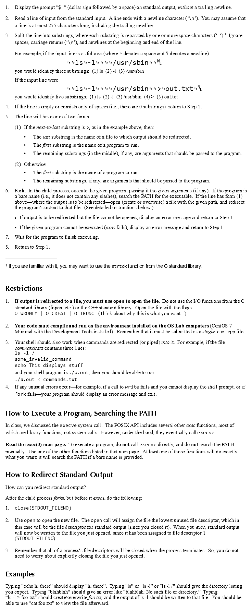

# Shell-assignment

## Description

This is my attempt at implementing a shell. Originally it was a school
assignment or something, but someone posted it online, and I thought
it looked like fun to implement, so here's my implementation.

## The assignment

This is the original assignment, it was given to me as an
image. Unfortunately I do not know the source of the image, though it
looks like it comes from a book.

